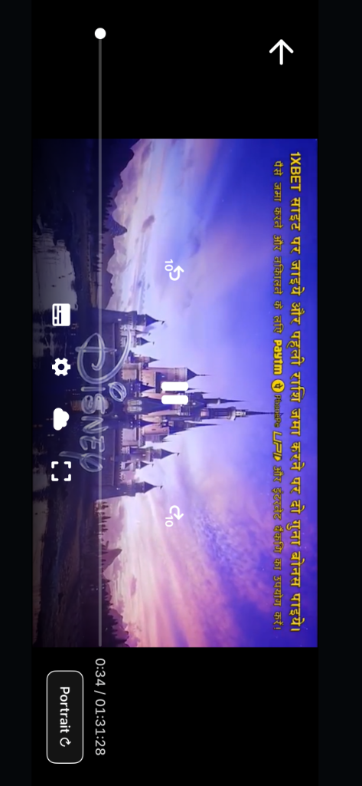

# Cineby iOS Wrapper

iOS native wrapper minimalis untuk situs streaming film [Cineby](https://cineby.at) dengan fitur premium **Bypass Portrait Orientation Lock** dan **Netflix-Style Playback Lock**.

---

## 📱 Fitur Utama

1. **Bypass Kunci Orientasi**: Menonton film dalam posisi landscape layar penuh secara instan meskipun *Portrait Orientation Lock* di iPhone Anda sedang aktif.
2. **Desain Bulat Minimalis (Reddit-Style)**: Tombol melayang berbentuk bulat (50x50) yang bersih menggunakan **SF Symbols** native.
3. **Netflix-Style Playback Lock**:
   * Kunci layar instan untuk memblokir seluruh interaksi sentuh pada video player (bebas dari jeda/timeout dan iklan pop-up).
   * **Auto-Hide**: Tombol gembok merah otomatis menghilang setelah 3 detik.
   * **Tap-to-Toggle**: Cukup ketuk layar sekali untuk memunculkan atau menyembunyikan kembali tombol gembok.
4. **Bebas Margin Hitam (Edge-to-Edge)**: Video memenuhi seluruh layar fisik tanpa terpotong safe area insets.

---

## 📸 Tangkapan Layar

| Tampilan Utama (Portrait) | Tampilan Pemutar Film (Landscape) |
| --- | --- |
|  |  |

---

## ⚙️ Cara Instalasi (Sideloadly)

1. Unduh file `unsigned-App.ipa` hasil build dari tab **Actions** di repositori GitHub Anda.
2. Sambungkan iPhone ke komputer (Windows/Mac).
3. Buka **Sideloadly**, masukkan Apple ID Anda, lalu seret file `.ipa` tersebut ke dalamnya.
4. Klik **Start** untuk menginstal.
5. Di iPhone Anda, masuk ke **Settings → General → VPN & Device Management** dan pilih **Trust** pada Apple ID Anda.

---

## 🚀 Panduan Penggunaan

1. Buka aplikasi **Cineby**, pilih film yang ingin ditonton.
2. Saat film diputar, ketuk ikon rotasi `arrow.triangle.2.circlepath` di pojok kanan atas navigation bar untuk masuk ke mode landscape.
3. **Mengunci Layar**: Ketuk tombol gembok terbuka `lock.open.fill` di pojok kiri bawah landscape. Tombol akan berubah merah dan menghilang dalam 3 detik.
4. **Membuka Kunci**: Ketuk layar sekali, lalu ketuk tombol gembok merah yang muncul.
5. Ketuk tombol rotasi melayang di pojok kanan bawah untuk kembali ke mode portrait.
