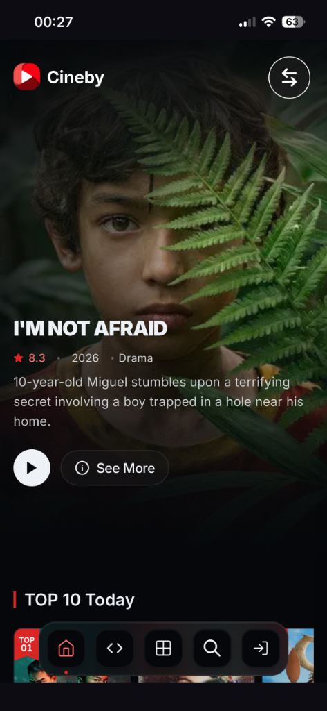

# Mstream iOS Wrapper

A minimalist native iOS wrapper for movie & anime streaming portals (Cineby & Nimegami) featuring **Bypass Portrait Orientation Lock**, **Netflix-Style Playback Lock**, and **Multi-Portal Selection**.

---

## 📱 Key Features

1. **Bypass Orientation Lock**: Instantly watch video streams in fullscreen landscape even when the system *Portrait Orientation Lock* is active on your iPhone.
2. **Reddit-Style Floating Controls**: Floating circular control buttons (50x50) styled using native Apple **SF Symbols** in both portrait and landscape modes (replacing navigation headers completely).
   * **Context-Sensitive Rotate Button**: The rotation button remains completely hidden while you are browsing lists or search descriptions. It automatically fades in **only when a video player/video element is actively detected** on the screen.
3. **Netflix-Style Playback Lock**:
   * Instant screen lock that disables all touch interactions on the video player/WebView (blocking ads, pop-ups, and accidental pause/seeking).
   * **Auto-Hide**: The red lock button automatically fades out after 3 seconds of inactivity.
   * **Tap-to-Toggle**: Simply tap anywhere on the screen to show or instantly hide the lock button.
4. **Edge-to-Edge Fullscreen (No Margins)**: Automatically overrides HTML viewport scales and safe area margins in landscape to fill the physical screen completely.
5. **Multi-Portal Selection Screen**: Choose between streaming movies/shows on **Cineby** or anime on **Nimegami** upon opening the app.
6. **Fast Web Switcher**: Quickly toggle between Cineby and Nimegami at any time with a dedicated floating button in portrait mode using a smooth cross-dissolve fade transition. The switcher automatically hides when watching a video in landscape.

---

## 📸 Screenshots

| Main View (Portrait) | Player View (Landscape) |
| --- | --- |
|  |  |

---

## ⚙️ How to Install (Sideloadly)

1. Download the `Mstream v1` build file from the **Actions** tab in your GitHub repository.
2. Connect your iPhone to your computer (Windows/Mac).
3. Open **Sideloadly**, enter your Apple ID, and drag the `.ipa` file into the app.
4. Click **Start** to install.
5. On your iPhone, go to **Settings → General → VPN & Device Management**, tap your Apple ID, and select **Trust**.

---

## 🚀 How to Use

1. Open the app and select your desired streaming portal (Cineby or Nimegami) from the selection landing screen.
2. Tap the floating swap button `arrow.left.arrow.right` in the top-right corner of the portrait screen at any time to switch instantly to the other website.
3. **Rotate Screen**: Once you open a video and it begins playing, the circular rotation icon `arrow.triangle.2.circlepath` will appear below the swap button in the top-right. Tap it to enter landscape mode.
4. **Locking the Screen**: Tap the unlocked padlock icon `lock.open.fill` at the bottom-left of the landscape screen. The button will turn red, lock touch gestures, and fade out in 3 seconds.
5. **Unlocking the Screen**: Tap anywhere on the blank screen to show the red padlock button, then tap the padlock button itself to unlock.
6. Tap the circular rotation button in the bottom-right of the landscape screen to return to portrait mode.
